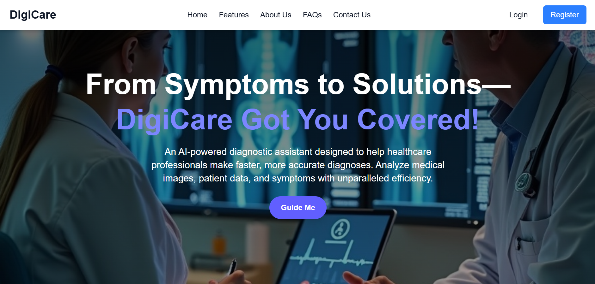
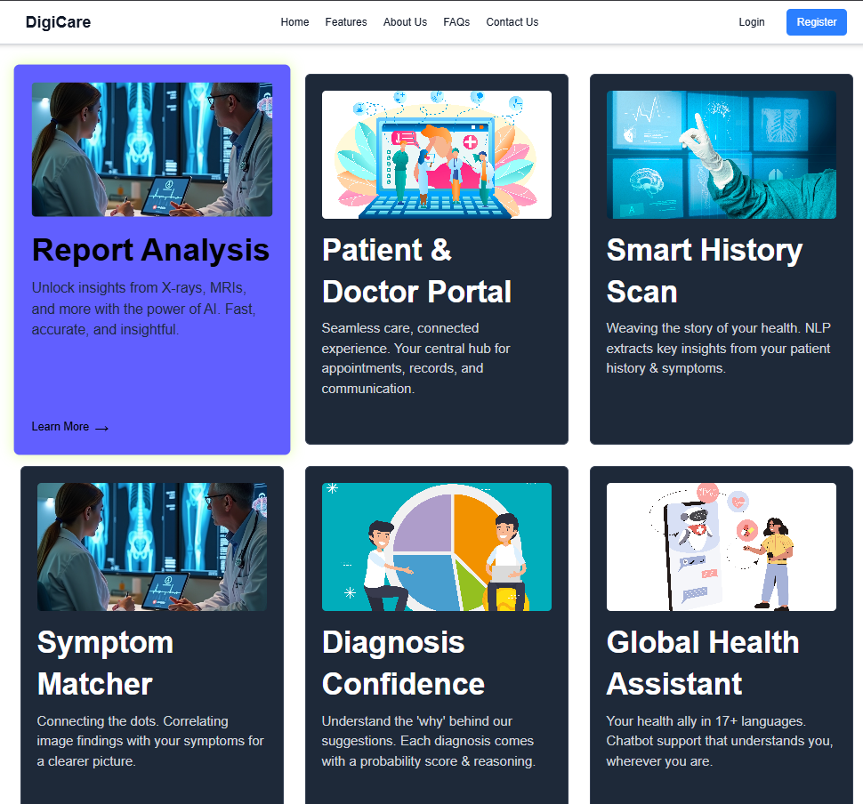
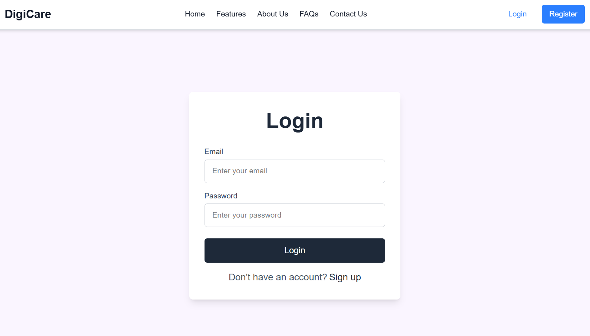
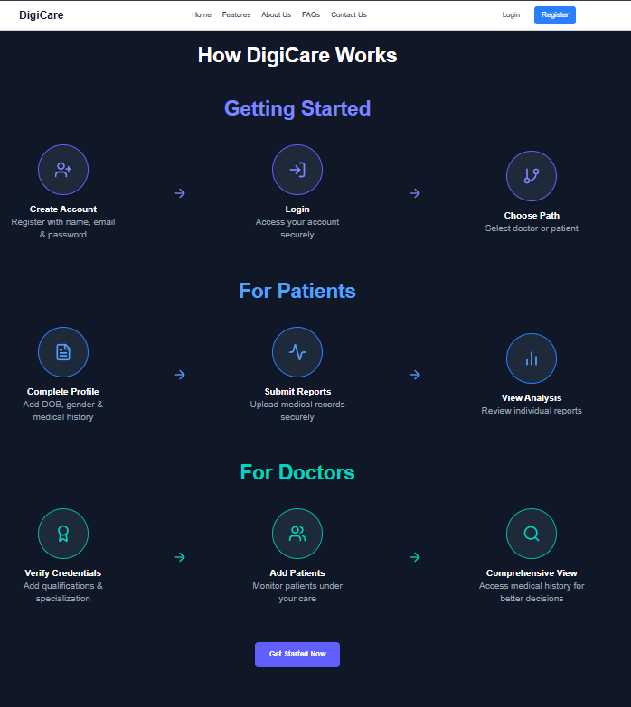

# 🩺 DigiCare - AI-Powered Full-Stack Healthcare Platform

DigiCare is a high-performance, intelligent healthcare portal designed to bridge the data coordination gap between clinicians and patients. It combines a secure full-stack database ecosystem with autonomous Python multi-agent clinical diagnostic summarizers.

## 🖼️ Application Workspace Visuals

### 🏠 Home View & Features



### 🔒 Secure Authentication & Onboarding



### 📈 Patient Portal Overview


### 🩺 Doctor Clinical Care Workspace


## 🛠️ Complete Full-Stack Architecture Blueprint
To operate the platform locally, ensure you split your terminal windows and fire up all 4 engine processes simultaneously:

### 1. Node.js Backend Server (Port 3000)
```bash
cd Backend
npm install
node server.js
```

### 2. Vite React Frontend Web Portal (Port 5173)
```bash
cd Frontend
npm install
npm run dev
```

### 3. FastAPI AI Report Analyzer (Port 8000)
```bash
cd Workers/report-analyzer
pip install -r requirements.txt
python -m uvicorn app:app --host 127.0.0.1 --port 8000 --reload
```

### 4. FastAPI Multi-Agent Smart-Scan Compiler (Port 8001)
```bash
cd Workers/smart-scan
python -m uvicorn app:app --host 127.0.0.1 --port 8001 --reload
```
